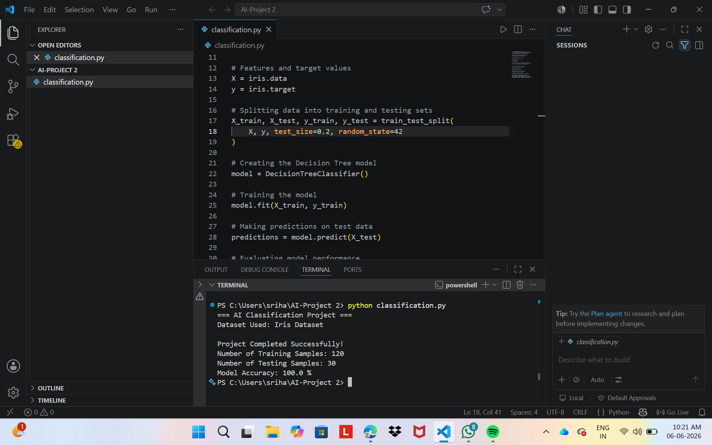

# Data Classification Using AI

## Overview

This project demonstrates a basic machine learning classification model using the Iris dataset. The model is trained and tested to classify flower species based on their features.

## Technologies Used

- Python
- Scikit-learn

## Dataset

- Iris Dataset

## Result

The AI classification model was successfully trained and tested using the Iris dataset.

### Output

- Training Samples: 120
- Testing Samples: 30
- Model Accuracy: 100% 

### Screenshot

## Conclusion

Successfully built and tested a classification model using supervised learning techniques.